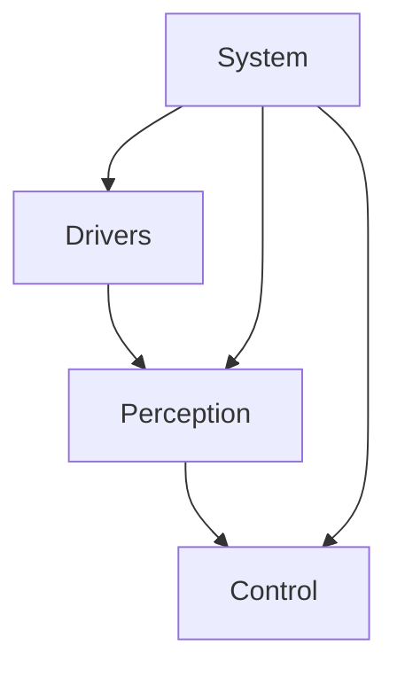

# System Architecture

## Overview
This document describes the overall architecture of the drone mapping system.

## Component Diagram

```
┌─────────────────────────────────────────────────────────────┐
│                     Drone Mapping System                     │
├─────────────────────────────────────────────────────────────┤
│                                                               │
│  ┌──────────────┐  ┌──────────────┐  ┌──────────────┐      │
│  │   Drivers    │  │  Perception  │  │   Control    │      │
│  ├──────────────┤  ├──────────────┤  ├──────────────┤      │
│  │ LiDAR        │  │ Point-LIO    │  │ Mission Ctl  │      │
│  │ IMU          │──▶│ SLAM         │──▶│ Health Mon   │      │
│  │ Camera       │  │ Hailo AI     │  │ Failsafe     │      │
│  │ MAVLink      │  │ Fusion       │  │              │      │
│  └──────────────┘  └──────────────┘  └──────────────┘      │
│                                                               │
│  ┌──────────────────────────────────────────────────────┐   │
│  │                    System Layer                       │   │
│  ├──────────────────────────────────────────────────────┤   │
│  │  Launch Files │ TF Tree │ Parameters │ Logging       │   │
│  └──────────────────────────────────────────────────────┘   │
│                                                               │
└─────────────────────────────────────────────────────────────┘
```

## Data Flow

### Sensor Pipeline
1. LiDAR driver publishes raw point clouds
2. IMU driver publishes orientation data
3. Point-LIO processes and registers point clouds
4. Camera captures RGB images
5. Hailo AI performs object detection
6. Semantic fusion combines LiDAR + AI detections

### Control Loop
1. Mission control receives waypoints
2. Health monitor checks system status
3. Failsafe manager handles emergencies
4. MAVLink bridge sends commands to drone

## Package Dependencies



## Container Architecture

### Development Environment (Docker)

```
┌─────────────────────────────────────────────────────────┐
│                  Docker Host Machine                     │
│                                                           │
│  ┌───────────────────┐        ┌───────────────────┐     │
│  │ LiDAR Container   │        │ MAVROS Container  │     │
│  ├───────────────────┤        ├───────────────────┤     │
│  │ Unitree L1        │        │ MAVROS Node       │     │
│  │ Point-LIO SLAM    │◄──────►│ MAVLink Bridge    │     │
│  │ Point Cloud Tools │  ROS2  │ PX4 Connection    │     │
│  └───────────────────┘   DDS  └───────────────────┘     │
│           │                             │                │
│           └─────────────┬───────────────┘                │
│                         │                                │
│                    Shared ROS2                            │
│                    Workspace (ws/)                        │
│                                                           │
└─────────────────────────────────────────────────────────┘
```

**Key Features:**
- **Network Mode: Host** - Enables ROS2 DDS discovery across containers
- **Shared Workspace** - Both containers mount `ws/` for custom packages
- **Independent Operation** - Containers can run separately or together
- **USB Device Access** - LiDAR on `/dev/ttyUSB*`, Flight controller on `/dev/ttyACM*`

### Production Environment (Raspberry Pi)

For deployment on Raspberry Pi, containers are **not used** to minimize resource overhead:

```
┌─────────────────────────────────────────────┐
│         Raspberry Pi (Native ROS2)          │
├─────────────────────────────────────────────┤
│  All nodes run natively in single OS        │
│  - LiDAR drivers                             │
│  - Point-LIO SLAM                            │
│  - MAVROS bridge                             │
│  - Custom control nodes                      │
└─────────────────────────────────────────────┘
```

See [Pi Deployment Guide](pi_deployment.md) for installation instructions.

## TODO
- [ ] Add detailed component descriptions
- [ ] Document inter-node communication
- [ ] Add timing diagrams
- [ ] Document data structures